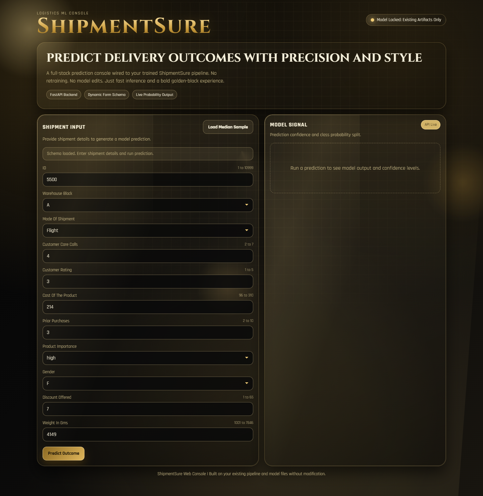
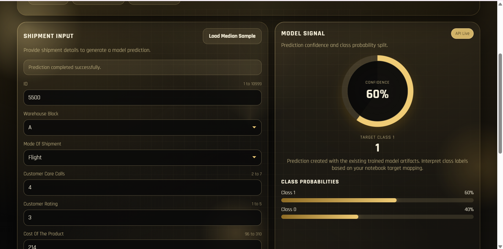

# ShipmentSure - Predicting On-Time Delivery

## Deployment Link
https://new-shipment-prediction.vercel.app/

## Output SS

## Benefits to Use This Website
- Predicts shipment delivery status quickly using supplier and logistics inputs.
- Helps teams identify delay risks before shipment completion.
- Supports better planning for operations, inventory, and customer communication.
- Provides a simple and accessible web interface for non-technical users.
- Reduces manual analysis effort by automating prediction.

## Tech Stack
- Frontend: HTML, CSS, JavaScript
- Backend: Python, FastAPI, Uvicorn
- Machine Learning: scikit-learn model pipeline (serialized with pickle/joblib)
- Deployment: Vercel (Frontend)
- Data Work: Jupyter Notebooks, Pandas, NumPy
